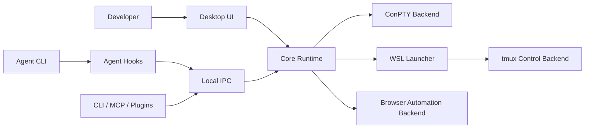
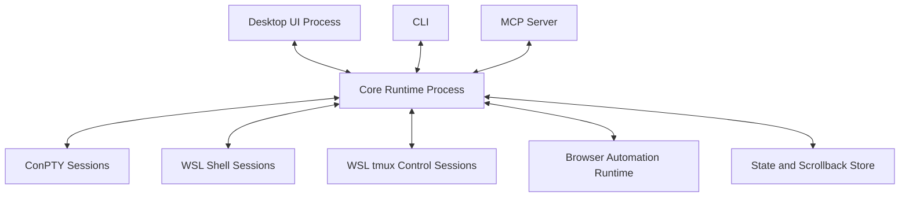
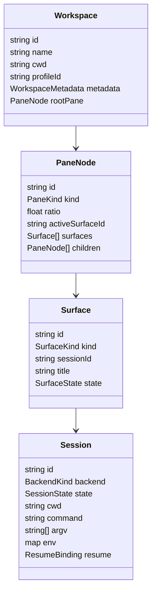
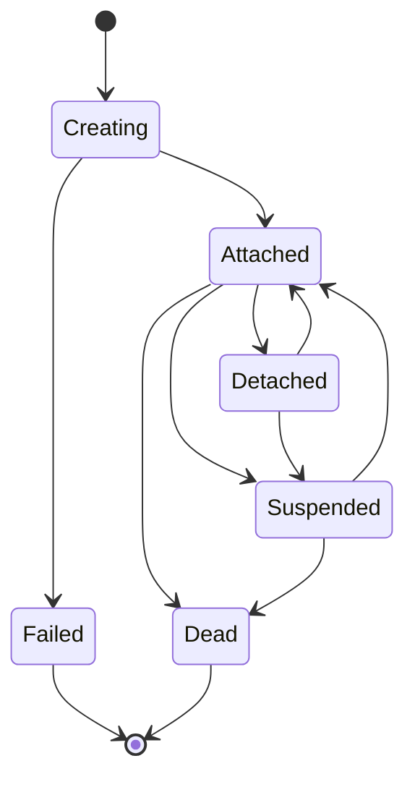
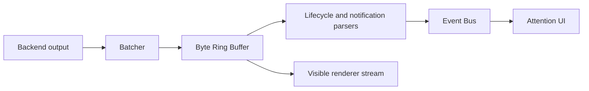

# AgentMux System Requirements and Detailed Design

Status: Draft
Date: 2026-06-18
Basis: ISO/IEC/IEEE 29148-style requirements structure and verification discipline

## 1. Introduction

### 1.1 Purpose

This document defines the system requirements and detailed design for AgentMux, a Windows-only AI-agent terminal multiplexer. The current production target is Windows, with first-class support for Linux development environments through WSL and durable session management through tmux-compatible backend semantics. Native macOS and Linux desktop support is intentionally tracked as backlog, not active release scope.

The document is written as a combined requirements and design specification. Each requirement is uniquely identified, stated in verifiable language, and linked to a planned verification method.

### 1.2 Scope

AgentMux provides a desktop multiplexer for running many AI coding agents, shells, and browser-driven development workflows in parallel. It manages workspaces, panes, terminal sessions, browser surfaces, notifications, agent lifecycle signals, and automation APIs.

The initial product scope includes:

- Windows desktop client.
- WSL-backed Linux shell sessions.
- Native Windows shell sessions.
- Durable terminal session management.
- tmux-compatible session attachment strategy for WSL environments.
- Agent-oriented notification and lifecycle tracking.
- Local automation API for CLI, MCP, and future integrations.
- Performance architecture suitable for dozens of concurrent sessions.

The initial product scope excludes:

- Cloud-hosted multi-user service.
- Strong same-user security isolation.
- Remote team collaboration over the network.
- Mobile clients.
- Native macOS and Linux desktop clients.
- Full terminal emulator implementation from scratch in the first release.

### 1.3 Product Vision

The product shall be a high-performance desktop substrate for AI-assisted software development. It shall let a developer run multiple agents and shells concurrently without losing context, without depending on a single visible terminal window, and without turning terminal sessions into disposable UI objects.

The system shall prioritize:

- Durable sessions over transient windows.
- Low idle overhead across many sessions.
- Fast pane switching and input latency.
- Explicit agent lifecycle visibility.
- Scriptable, composable primitives.
- Compatibility with Linux-first development workflows on Windows through WSL.

### 1.4 Definitions

| Term | Definition |
|---|---|
| Agent | A CLI-based AI coding assistant, automation worker, or developer tool running inside a terminal session. |
| Backend | The subsystem that owns process, PTY, tmux-control, or session IO. |
| Pane | A visual container that displays one active surface. |
| Surface | A terminal, browser, editor, log, or other pane content type. |
| Workspace | A named collection of panes, surfaces, metadata, and automation context. |
| Session | A durable execution context for a shell or agent process. |
| Control Plane | Local IPC, CLI, and MCP APIs used to inspect and control the system. |
| Data Plane | High-throughput terminal, browser, and event streams. |
| WSL | Windows Subsystem for Linux. |
| ConPTY | Windows pseudoconsole API used for native Windows PTY hosting. |
| tmux Control Mode | A line-oriented tmux protocol suitable for external clients that mirror tmux sessions. |

### 1.5 Requirement Keywords

The terms shall, should, may, and should not are used as follows:

- Shall: mandatory requirement.
- Should: recommended requirement, subject to tradeoff.
- May: optional capability.
- Should not: discouraged behavior unless justified by design review.

## 2. Stakeholders and Use Cases

### 2.1 Stakeholders

| Stakeholder | Interest |
|---|---|
| Developer | Run many agent sessions and shells efficiently. |
| Power user | Persist, restore, script, and inspect sessions. |
| Agent process | Send notifications, request input, and receive orchestrated commands. |
| Local automation tool | Control panes and read output through stable APIs. |
| Security reviewer | Validate local IPC, permissions, and sensitive data handling. |
| Maintainer | Evolve architecture without breaking automation contracts. |

### 2.2 User Classes

| User Class | Description |
|---|---|
| Solo developer | Uses the app interactively with several panes and agents. |
| Heavy agent operator | Runs 10 to 50 concurrent agent sessions. |
| Automation author | Scripts workspace creation, command dispatch, and result collection. |
| Extension author | Builds MCP, CLI, or plugin integrations on top of the control plane. |

### 2.3 Primary Use Cases

#### UC-001: Run Multiple Agents

A developer opens a project workspace and starts several agents in separate panes. Each pane remains addressable by ID and visible in a workspace overview. When an agent becomes idle, completes, or needs input, the UI surfaces that state without requiring the user to inspect every pane manually.

#### UC-002: Preserve Sessions Across App Restart

A developer closes or crashes the desktop UI while long-running sessions continue. When the UI restarts, it reconnects to durable sessions, restores layout, and shows recovered output without duplicating processes.

#### UC-003: Use Linux Development Environment on Windows

A developer launches a WSL-backed workspace. Shells and agents run inside the selected WSL distribution, while the Windows desktop app renders and controls the session.

#### UC-004: Script Workspace and Pane Operations

An external tool creates workspaces, splits panes, sends text, reads visible output, and subscribes to event streams through local IPC or CLI commands.

#### UC-005: Browser-Assisted Agent Workflow

An agent opens a browser surface, navigates to a local development server, inspects the page, captures screenshots, and performs controlled interactions through an automation API.

## 3. System Overview

### 3.1 System Context



### 3.2 Product Architecture Summary

The system is composed of:

- A desktop UI process for layout, input, rendering, and user interaction.
- A core runtime process for session state, IPC, routing, backpressure, persistence, and policy.
- Backend adapters for native Windows shells, WSL shells, and tmux-control sessions.
- A terminal rendering layer that can initially use an existing terminal renderer while preserving an abstraction boundary for future native or GPU rendering.
- A local control plane based on authenticated IPC and CLI wrappers.
- A browser automation layer for local web workflows.

### 3.3 Architectural Principles

| ID | Principle |
|---|---|
| AP-001 | Sessions shall outlive visible panes where technically possible. |
| AP-002 | Hidden panes shall not consume foreground rendering resources. |
| AP-003 | High-throughput streams shall be batched and backpressured. |
| AP-004 | Control-plane APIs shall be stable, versioned, and permission-aware. |
| AP-005 | Backend adapters shall be replaceable behind explicit interfaces. |
| AP-006 | The first Windows release shall treat WSL as a first-class shell environment, not an afterthought. |
| AP-007 | Product behavior shall be measured with repeatable performance benchmarks. |

## 4. Requirements

### 4.1 Functional Requirements

| ID | Requirement | Priority | Verification |
|---|---|---:|---|
| FR-001 | The system shall create, rename, focus, reorder, and close workspaces. | Must | Unit, integration |
| FR-002 | The system shall create vertical and horizontal split panes. | Must | Unit, UI automation |
| FR-003 | The system shall assign stable IDs to workspaces, panes, surfaces, and sessions. | Must | Unit |
| FR-004 | The system shall launch native Windows shells through ConPTY. | Must | Integration on Windows |
| FR-005 | The system shall launch WSL shells in a selected distribution and working directory. | Must | Integration on Windows |
| FR-006 | The system shall support a tmux-control backend for WSL session mirroring. | Must | Integration with tmux |
| FR-007 | The system shall support durable detach and reattach for eligible sessions. | Must | Restart test |
| FR-008 | The system shall restore workspace layout after UI restart. | Must | Restart test |
| FR-009 | The system shall restore terminal scrollback or equivalent output history after UI restart. | Must | Restart test |
| FR-010 | The system shall avoid creating duplicate processes during restore. | Must | Integration |
| FR-011 | The system shall route keyboard input to the focused terminal surface. | Must | UI automation |
| FR-012 | The system shall resize backend sessions when pane dimensions change. | Must | Integration |
| FR-013 | The system shall coalesce resize events to prevent resize storms. | Should | Performance test |
| FR-014 | The system shall expose a local API to list workspaces, panes, surfaces, and sessions. | Must | API test |
| FR-015 | The system shall expose a local API to send text and named keys to terminal surfaces. | Must | API test |
| FR-016 | The system shall expose a local API to read recent terminal output. | Must | API test |
| FR-017 | The system shall expose a local API to stream or poll lifecycle events. | Should | API test |
| FR-018 | The system shall expose a CLI wrapper over supported local API operations. | Must | CLI test |
| FR-019 | The system shall support MCP integration for terminal and browser operations. | Should | MCP integration test |
| FR-020 | The system shall parse terminal notification escape sequences where supported. | Should | Parser unit test |
| FR-021 | The system shall parse shell lifecycle markers where supported. | Should | Parser integration |
| FR-022 | The system shall detect agent lifecycle states from hooks, shell markers, or output heuristics. | Should | Integration |
| FR-023 | The system shall display pending agent attention in the workspace and pane UI. | Must | UI automation |
| FR-024 | The system shall support desktop notifications for attention events. | Should | Manual, integration |
| FR-025 | The system shall provide a notification panel or equivalent history view. | Should | UI automation |
| FR-026 | The system shall create browser surfaces in panes. | Should | UI automation |
| FR-027 | The system shall expose browser navigation, screenshot, DOM snapshot, click, type, and evaluation operations through the control plane. | Should | Browser automation test |
| FR-028 | The system shall keep browser automation scoped to the selected browser surface. | Must | API test |
| FR-029 | The system shall support project-level startup configuration. | Should | Config test |
| FR-030 | The system shall support custom command definitions for workspaces. | Could | Config test |
| FR-031 | The system shall support per-workspace environment overlays. | Should | Integration |
| FR-032 | The system shall sanitize sensitive environment values before storing resume metadata. | Must | Unit |
| FR-033 | The system shall expose health and diagnostics for runtime processes. | Should | API test |
| FR-034 | The system shall provide user-visible recovery states for disconnected or failed backend sessions. | Must | UI automation |
| FR-035 | The system shall provide a safe close flow for sessions with running foreground processes. | Should | UI automation |

### 4.2 Performance Requirements

| ID | Requirement | Priority | Verification |
|---|---|---:|---|
| PR-001 | The system shall support at least 20 idle terminal sessions without sustained UI jank on a mid-range Windows developer laptop. | Must | Performance benchmark |
| PR-002 | The system should support 50 idle terminal sessions with bounded memory growth. | Should | Performance benchmark |
| PR-003 | The p95 visible keystroke-to-echo latency shall remain below 50 ms in a one-pane workspace on reference hardware. | Must | Performance benchmark |
| PR-004 | The p95 visible keystroke-to-frame latency should remain below 80 ms with eight mounted panes on reference hardware. | Should | Performance benchmark |
| PR-005 | Switching to an already-running workspace shall complete within 100 ms p95 excluding backend reconnect delays. | Must | Performance benchmark |
| PR-006 | Hidden panes shall not retain GPU renderer resources beyond a bounded grace period. | Must | Unit, performance |
| PR-007 | Backend output shall be batched before UI dispatch. | Must | Unit, performance |
| PR-008 | The system shall apply backpressure or bounded buffering when terminal output exceeds UI consumption rate. | Must | Stress test |
| PR-009 | Per-session scrollback memory shall be bounded by configuration. | Must | Unit |
| PR-010 | Startup time to first usable terminal should be below 2 seconds on reference hardware. | Should | Performance benchmark |
| PR-011 | The system shall include repeatable local performance benchmark scripts. | Must | CI/local benchmark |
| PR-012 | Performance benchmarks shall record CPU, memory, input latency, and startup milestones. | Must | Benchmark review |

### 4.3 Reliability and Availability Requirements

| ID | Requirement | Priority | Verification |
|---|---|---:|---|
| RR-001 | The core runtime shall survive desktop UI restart when live sessions exist. | Must | Restart test |
| RR-002 | Session metadata persistence shall use atomic writes. | Must | Unit |
| RR-003 | Corrupt persistence files shall not prevent application startup. | Must | Fault injection |
| RR-004 | The system shall distinguish live, detached, suspended, dead, and failed sessions. | Must | Unit |
| RR-005 | The system shall not silently discard terminal output unless a bounded overflow policy is triggered and recorded. | Must | Stress test |
| RR-006 | The system shall expose reconnect controls for backend sessions. | Should | UI automation |
| RR-007 | The system shall include watchdog or health checks for the core runtime. | Should | Integration |
| RR-008 | The system shall recover cleanly from WSL distribution unavailability. | Must | Fault injection |
| RR-009 | The system shall recover cleanly from missing tmux binary in WSL. | Must | Fault injection |
| RR-010 | The system shall degrade to direct WSL shell mode when tmux-control mode is unavailable and the user permits fallback. | Should | Integration |

### 4.4 Security Requirements

| ID | Requirement | Priority | Verification |
|---|---|---:|---|
| SR-001 | Local IPC shall require a per-user authentication token or OS-backed equivalent. | Must | Integration |
| SR-002 | The IPC token shall not be injected into child shell environments. | Must | Unit |
| SR-003 | Sensitive environment keys shall be redacted from persisted metadata. | Must | Unit |
| SR-004 | Control-plane methods shall be grouped by capability. | Must | Unit |
| SR-005 | Mutation methods exposed to plugins shall require explicit capability declaration or first-party trust. | Should | Integration |
| SR-006 | Browser automation shall validate target surface ownership. | Must | API test |
| SR-007 | File-opening actions from terminal links shall validate paths and block unsafe direct execution by default. | Should | Unit |
| SR-008 | Remote or WSL path translation shall avoid command-line injection. | Must | Unit |
| SR-009 | Logs shall avoid writing credentials, tokens, and full prompts by default. | Must | Review, unit |
| SR-010 | The security model shall document that same-user malware is out of scope. | Must | Documentation review |

### 4.5 Usability Requirements

| ID | Requirement | Priority | Verification |
|---|---|---:|---|
| UR-001 | The first screen shall be the usable multiplexer workspace, not a marketing or landing page. | Must | UI review |
| UR-002 | The UI shall show workspace, pane, and agent attention state without requiring users to inspect each pane. | Must | UI automation |
| UR-003 | Keyboard shortcuts shall be configurable. | Should | UI automation |
| UR-004 | The default shortcut set shall avoid common terminal conflicts where practical. | Should | Manual QA |
| UR-005 | The UI shall provide accessible focus indicators. | Should | Accessibility review |
| UR-006 | Text in buttons, tabs, and panes shall not overlap at supported window sizes. | Must | Visual QA |
| UR-007 | The system shall provide useful error messages for WSL, shell, tmux, IPC, and restore failures. | Must | Fault injection |

### 4.6 Compatibility Requirements

| ID | Requirement | Priority | Verification |
|---|---|---:|---|
| CR-001 | The initial release shall support Windows 10 and Windows 11 versions that support ConPTY. | Must | Compatibility matrix |
| CR-002 | The initial release shall support WSL 2 distributions with common Linux shells. | Must | Compatibility matrix |
| CR-003 | The system should support PowerShell, PowerShell Core, Command Prompt, and WSL shell targets. | Should | Integration |
| CR-004 | The control API shall use versioned request and response schemas. | Must | API test |
| CR-005 | The system shall include forward-compatible capability discovery. | Must | API test |
| CR-006 | The system shall avoid requiring a specific agent vendor or workflow. | Must | Review |
| CR-007 | Native macOS and Linux desktop builds shall remain out of scope until promoted from the platform backlog. | Must | Documentation review |

## 5. External Interface Requirements

### 5.1 Desktop UI Interface

The desktop UI shall provide:

- Workspace sidebar.
- Pane split layout.
- Surface tabs within panes where multiple surfaces are present.
- Command palette.
- Notification or attention panel.
- Browser surface.
- Settings panel.
- Runtime diagnostics view.

### 5.2 CLI Interface

The CLI shall provide a stable wrapper for local API operations.

Required command families:

| Family | Example Operations |
|---|---|
| system | ping, capabilities, identify |
| workspace | list, create, focus, close, rename |
| pane | list, split, focus, close |
| surface | list, focus, close |
| terminal | send, send-key, read |
| notification | notify, list, clear, mark-read |
| browser | open, navigate, screenshot, evaluate |
| session | list, attach, detach, kill, status |
| config | validate, paths, reload |

### 5.3 IPC Interface

IPC shall use newline-delimited JSON messages over a local transport. Windows named pipes shall be the default Windows transport. Loopback TCP may be provided as a fallback for specific elevation or pipe access failures.

Request envelope:

```json
{
  "id": "request-id",
  "method": "namespace.method",
  "params": {},
  "token": "redacted",
  "client": {
    "name": "client-name",
    "version": "client-version"
  }
}
```

Success response:

```json
{
  "id": "request-id",
  "ok": true,
  "result": {}
}
```

Error response:

```json
{
  "id": "request-id",
  "ok": false,
  "error": {
    "code": "error_code",
    "message": "human-readable message",
    "details": {}
  }
}
```

### 5.4 MCP Interface

The MCP server shall expose a curated subset of the local API. The initial tool groups should include:

- Workspace inspection.
- Pane inspection and focus.
- Terminal read and send.
- Browser open, navigate, screenshot, snapshot, click, type, evaluate.
- Event polling.
- Agent-to-agent messaging where enabled.

MCP calls that mutate terminal input, browser state, or workspace state shall be capability-gated.

### 5.5 Backend Interfaces

#### 5.5.1 Native Windows PTY Backend

The native Windows backend shall use ConPTY-compatible process hosting. It shall provide:

- Spawn.
- Write.
- Resize.
- Read output stream.
- Exit detection.
- Working directory.
- Environment overlay.

#### 5.5.2 WSL Shell Backend

The WSL shell backend shall launch commands inside a selected WSL distribution and working directory. It shall provide:

- Distribution enumeration.
- Windows-to-WSL path translation.
- WSL-to-Windows path translation where needed.
- Direct interactive shell mode.
- Error detection for missing distribution, missing path, and launch failure.

#### 5.5.3 WSL tmux-Control Backend

The tmux-control backend shall attach to or create tmux sessions inside WSL and mirror session topology into the app model.

Required capabilities:

- Attach to a named session.
- Create session when absent.
- Track windows and panes.
- Receive pane output.
- Send pane input.
- Resize client.
- Track active pane and layout changes.
- Recover after transient transport failure.

The parser shall treat tmux control output as a byte protocol. Pane output shall preserve bytes until terminal rendering or decoding layers process them.

### 5.6 Browser Automation Interface

Browser automation shall support:

- Open or focus browser surface.
- Navigate.
- Back and forward.
- Reload.
- Screenshot.
- DOM or accessibility snapshot.
- Click.
- Fill and type.
- Key press.
- JavaScript evaluation.
- Console and network event access where enabled.

Each browser operation shall require an explicit browser surface ID or a deterministic caller-scoped default.

## 6. Detailed Design

### 6.1 Process Architecture



The UI process should be disposable. It shall not be the sole owner of live shell processes. The core runtime shall own session lifecycle, session metadata, scrollback buffers, routing, and IPC.

### 6.2 Module Breakdown

| Module | Responsibility |
|---|---|
| App Shell | Window, menus, command palette, settings, global shortcuts. |
| Workspace Manager | Workspace list, active workspace, workspace metadata. |
| Pane Manager | Split tree, focus, resize, pane lifecycle. |
| Surface Manager | Terminal, browser, editor, and auxiliary surface lifecycle. |
| Session Manager | Durable session creation, attach, detach, restore, state transitions. |
| Backend Router | Routes operations to ConPTY, WSL direct, or tmux-control backends. |
| Terminal Stream Service | Output batching, ring buffers, scrollback, event extraction. |
| Renderer Adapter | Terminal renderer abstraction for visible surfaces. |
| Browser Service | Browser lifecycle and automation API. |
| Event Bus | Ordered event buffer for lifecycle, output summaries, notifications. |
| IPC Server | Authenticated control-plane transport. |
| CLI | Human and script entrypoint over IPC. |
| MCP Server | Agent-facing tool surface over IPC. |
| Config Service | User, project, and workspace configuration. |
| Security Service | Token, capability, permission, and redaction policies. |
| Diagnostics Service | Health, logs, metrics, benchmark hooks. |

### 6.3 Core Data Model



### 6.4 Session State Machine



State definitions:

| State | Meaning |
|---|---|
| Creating | Session record exists but backend process is not ready. |
| Attached | Session has at least one active UI or control attachment. |
| Detached | Backend session is alive without visible attachment. |
| Suspended | Session is intentionally inactive but has resume metadata. |
| Dead | Backend process ended. |
| Failed | Session could not be created or recovered. |

### 6.5 Output Pipeline

Terminal output shall flow through bounded stages:



Design rules:

- Backend output shall not synchronously force React or UI layout work per chunk.
- Output batches should flush at frame-friendly intervals.
- Hidden panes shall update buffers and metadata but should not repaint terminal canvases.
- Overflow policy shall be explicit and observable.
- Parsers shall be isolated so parser failure cannot stop raw output delivery.

### 6.6 Rendering Strategy

The rendering layer shall be abstracted behind a terminal renderer interface:

```text
TerminalRenderer
  open(container, options)
  write(bytes or text)
  resize(cols, rows)
  focus()
  getSelection()
  readVisibleText()
  dispose()
```

Initial implementation may use an existing terminal renderer. The architecture shall allow replacing or augmenting it with a native or GPU renderer later.

Rendering policies:

- Only visible terminal surfaces should be fully mounted.
- Recently hidden surfaces may keep renderer state for a short grace period.
- Long-hidden surfaces shall release GPU and DOM resources.
- Renderer state shall be reconstructable from session scrollback and current screen data where feasible.

### 6.7 WSL tmux-Control Backend Design

The WSL tmux-control backend shall be implemented as a backend adapter with the same external session interface as the native PTY backend.

Responsibilities:

- Start control process inside WSL.
- Attach to tmux session.
- Parse control-mode messages.
- Maintain mapping from tmux session/window/pane IDs to internal session, workspace, pane, and surface IDs.
- Forward pane output to terminal stream service.
- Send input to the correct tmux pane.
- Apply client size changes.
- Reconnect after transport interruption.

Parser design:

- The parser shall consume bytes, not pre-decoded strings, for pane output.
- Command results shall be correlated to issued commands.
- Unexpected or malformed control messages shall be logged and skipped when safe.
- Parser buffer sizes shall be bounded.
- A parser error shall transition the backend to reconnecting or failed state without crashing the core runtime.

### 6.8 Direct WSL Backend Design

Direct WSL mode shall launch a shell or command without tmux-control session mirroring. It is simpler and useful for compatibility. It does not provide the same topology awareness or durable session semantics as the tmux-control backend.

Direct WSL mode shall be used when:

- The user selects direct shell mode.
- tmux is unavailable and fallback is enabled.
- A command is unsuitable for tmux-control wrapping.

### 6.9 Native Windows Backend Design

The native Windows backend shall use ConPTY and shall support:

- Shell resolution.
- Environment filtering.
- Working directory validation.
- PTY read and write.
- Resize.
- Exit status.
- Process tree identity tracking where needed for agent and MCP association.

### 6.10 Agent Lifecycle Design

Agent lifecycle signals may come from:

- Explicit hooks.
- Shell lifecycle markers.
- Terminal notification sequences.
- Output and prompt heuristics.
- Process exit.

The event model shall normalize these into:

| Event | Meaning |
|---|---|
| agent.started | Agent process appears to have started. |
| agent.running | Agent is actively producing output or executing. |
| agent.awaiting_input | Agent is blocked on a user decision or answer. |
| agent.completed | Agent turn completed successfully or is ready for next prompt. |
| agent.failed | Agent process or turn failed. |
| agent.exited | Agent process exited. |

The system shall deduplicate multiple signals for the same lifecycle transition within a short window.

### 6.11 Browser Surface Design

Browser surfaces shall be first-class surfaces. They shall be placed in panes like terminal surfaces and addressed by stable IDs.

The browser service shall:

- Create isolated browser contexts where needed.
- Associate browser surfaces with workspaces.
- Expose automation through the control plane.
- Prevent browser operations from affecting the wrong workspace or surface.
- Support screenshot and DOM snapshot retrieval.

### 6.12 Persistence Design

The system shall persist:

- Workspace layout.
- Surface list.
- Session metadata.
- Resume bindings.
- Scrollback or output ring snapshots.
- User settings.
- Project trust decisions.

Persistence rules:

- Writes shall be atomic.
- Schema versions shall be stored with every persisted file.
- Migrations shall be explicit and testable.
- Sensitive fields shall be redacted.
- Corrupt files shall be quarantined or ignored with user-visible diagnostics.

### 6.13 Configuration Design

Configuration sources, from lowest to highest precedence:

1. Built-in defaults.
2. User global configuration.
3. Project configuration.
4. Workspace profile configuration.
5. Explicit CLI or API call parameters.

Configuration categories:

- Shell and WSL defaults.
- Backend selection.
- Terminal theme and font.
- Scrollback limits.
- Keybindings.
- Agent hooks.
- Browser behavior.
- Security and permission settings.
- Performance tuning.

### 6.14 Error Handling Design

Errors shall use structured codes:

| Code | Meaning |
|---|---|
| invalid_params | Caller supplied invalid parameters. |
| unauthorized | Auth token missing or invalid. |
| forbidden | Caller lacks capability. |
| not_found | Requested resource does not exist. |
| conflict | Operation conflicts with current state. |
| backend_unavailable | Required backend unavailable. |
| resource_exhausted | Resource limits reached. |
| timeout | Operation timed out. |
| internal_error | Unexpected internal failure. |

Every user-visible backend error shall include:

- What failed.
- Which backend failed.
- Whether retry is available.
- A concise remediation hint.

## 7. Verification Strategy

### 7.1 Verification Methods

| Method | Description |
|---|---|
| Inspection | Review design, code, or generated artifacts. |
| Analysis | Prove behavior through static reasoning or model checks. |
| Unit Test | Validate isolated functions, parsers, and state machines. |
| Integration Test | Validate process, PTY, WSL, tmux, IPC, and browser behavior. |
| UI Automation | Validate user-visible flows. |
| Fault Injection | Validate recovery from missing binaries, corrupt files, disconnected pipes, and backend failure. |
| Performance Benchmark | Measure startup, latency, CPU, memory, and throughput. |
| Manual QA | Validate OS-specific behavior that is hard to automate initially. |

### 7.2 Minimum Test Suites

| Suite | Coverage |
|---|---|
| Parser Tests | tmux-control messages, OSC sequences, shell markers, notification payloads. |
| State Machine Tests | Workspace, pane, surface, session lifecycle. |
| IPC Tests | Auth, schema validation, error envelopes, capabilities. |
| Backend Tests | ConPTY, WSL launch, tmux attach, resize, exit. |
| Persistence Tests | Atomic write, migration, corrupt file handling, restore. |
| Renderer Tests | Visibility, hidden-pane resource release, resize guards. |
| Browser Tests | Surface scoping, navigation, screenshot, DOM snapshot, interaction. |
| Security Tests | Token handling, env redaction, permission checks. |
| Performance Tests | Cold start, input latency, memory, output throughput. |

### 7.3 Traceability Matrix

| Requirement Group | Primary Verification Suites |
|---|---|
| FR-001 to FR-003 | State Machine Tests, UI Automation |
| FR-004 to FR-006 | Backend Tests |
| FR-007 to FR-010 | Persistence Tests, Fault Injection |
| FR-011 to FR-013 | Backend Tests, Renderer Tests |
| FR-014 to FR-019 | IPC Tests, CLI Tests, MCP Tests |
| FR-020 to FR-025 | Parser Tests, UI Automation |
| FR-026 to FR-028 | Browser Tests |
| FR-029 to FR-035 | Config Tests, Fault Injection |
| PR-001 to PR-012 | Performance Tests |
| RR-001 to RR-010 | Persistence Tests, Fault Injection |
| SR-001 to SR-010 | Security Tests, Documentation Review |
| UR-001 to UR-007 | UI Automation, Visual QA |
| CR-001 to CR-006 | Compatibility Matrix, API Tests |

## 8. Performance Benchmark Plan

### 8.1 Reference Scenarios

| Scenario | Measurement |
|---|---|
| Cold start | Time to first usable terminal. |
| One-pane input | p50, p95, p99 echo and frame latency. |
| Eight-pane input | p50, p95, p99 echo and frame latency. |
| Twenty idle sessions | CPU, memory, process count, renderer resources. |
| Fifty idle sessions | CPU, memory, process count, renderer resources. |
| High-output session | Output throughput, dropped bytes, UI responsiveness. |
| Workspace switching | p50, p95 switch latency. |
| Restore | Time to recover layout and attach sessions. |

### 8.2 Resource Accounting

Benchmarks shall report:

- UI process memory.
- Core runtime memory.
- Backend process memory.
- Child shell or agent process memory when observable.
- GPU or renderer resource count where observable.
- CPU by process group.
- Output bytes processed.
- Event loop delay or equivalent runtime lag.

### 8.3 Regression Policy

Performance baselines shall be descriptive measurements tied to hardware and OS version. A performance gate shall fail only when a metric regresses beyond both relative and absolute thresholds. Baseline updates shall require an explicit rationale.

## 9. Deployment and Packaging

### 9.1 Windows Packaging

The Windows release should provide:

- Signed installer when available.
- Portable archive for development builds.
- CLI binary in PATH or install directory.
- Auto-update strategy after signing and integrity checks are in place.

### 9.2 Runtime Dependencies

The application shall not require users to install development toolchains for normal use.

Optional dependencies:

- WSL for Linux-backed sessions.
- tmux inside selected WSL distributions for tmux-control sessions.
- Browser runtime if not bundled.

The app shall detect missing optional dependencies and provide remediation instructions.

## 10. Risk Register

| ID | Risk | Impact | Mitigation |
|---|---|---|---|
| RK-001 | Hidden pane rendering consumes excessive memory. | High | Renderer virtualization, GPU context caps, benchmark gates. |
| RK-002 | WSL path translation corrupts commands. | High | Structured argument passing, path translation tests. |
| RK-003 | tmux-control parser desynchronizes. | High | Byte parser, command correlation, fuzz and fixture tests. |
| RK-004 | Session restore duplicates processes. | High | Stable session IDs, attach-before-spawn policy, restart tests. |
| RK-005 | Local IPC token leaks to child processes. | High | Environment filtering, unit tests. |
| RK-006 | Many agents overwhelm UI with output. | High | Batching, backpressure, hidden-pane policies. |
| RK-007 | Browser automation acts on wrong surface. | Medium | Explicit surface IDs, ownership validation. |
| RK-008 | MCP identity is stale after restart. | Medium | Runtime identity refresh, boot ID, ownership validation. |
| RK-009 | Performance targets vary by hardware. | Medium | Hardware-labeled baselines and trend history. |
| RK-010 | First release scope grows too broad. | High | MVP boundary and release gates. |

## 11. MVP Boundary

The first engineering milestone shall deliver:

- Windows app shell.
- Core runtime.
- Authenticated IPC.
- Workspace and split-pane model.
- Native Windows shell backend.
- WSL direct shell backend.
- tmux-control backend prototype.
- Terminal renderer abstraction.
- Visible-pane rendering.
- Basic CLI.
- Basic session persistence.
- Agent notification primitive.
- Performance benchmark harness.

The first public release candidate shall add:

- Robust restore.
- Browser surface.
- MCP tool subset.
- Config files.
- Security documentation.
- Error diagnostics.
- Performance gates.

## 12. Open Decisions

| ID | Decision | Options | Required Evidence |
|---|---|---|---|
| OD-001 | UI framework | Native UI, lightweight web UI, hybrid | Memory and input latency prototype |
| OD-002 | Initial renderer | Existing web terminal, native renderer, hybrid | Throughput and memory benchmark |
| OD-003 | Core runtime language | Rust, Go, C# | PTY, IPC, maintenance tradeoff |
| OD-004 | Browser runtime | Embedded browser, external browser control | Automation reliability and packaging |
| OD-005 | Default backend for WSL | Direct shell, tmux-control | Durability and compatibility benchmark |
| OD-006 | Event delivery model | Push, poll, hybrid | MCP compatibility and backpressure analysis |

## 13. Acceptance Criteria

The system shall not be considered ready for first public release until:

- All Must requirements in Sections 4.1 through 4.6 have passing verification or documented deferral.
- The app can run native Windows and WSL sessions.
- The app can restore layout and eligible sessions after UI restart.
- The control API can create, inspect, focus, read, and send to panes.
- Performance benchmark results are recorded and reviewed.
- Security model and IPC token handling are documented and tested.
- No known data-loss issue exists in session persistence.
- No known issue causes hidden panes to consume unbounded rendering resources.

## 14. Appendix A: Requirement Quality Checklist

Each requirement should be:

- Necessary.
- Implementation-independent where possible.
- Unambiguous.
- Singular.
- Feasible.
- Verifiable.
- Traceable.
- Prioritized.

## 15. Appendix B: Naming Conventions

Requirement prefixes:

| Prefix | Meaning |
|---|---|
| FR | Functional Requirement |
| PR | Performance Requirement |
| RR | Reliability Requirement |
| SR | Security Requirement |
| UR | Usability Requirement |
| CR | Compatibility Requirement |
| AP | Architecture Principle |
| RK | Risk |
| OD | Open Decision |
