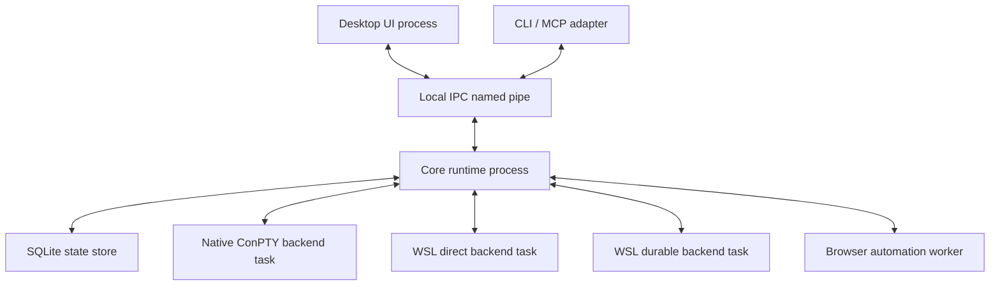
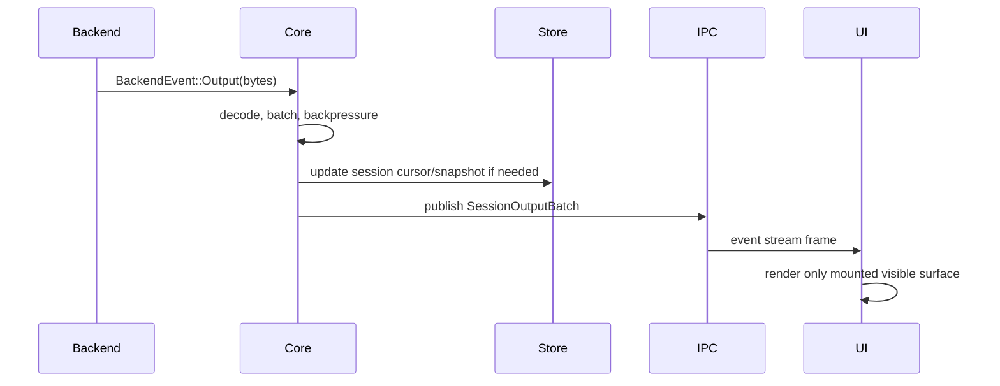

# Runtime Architecture

Status: Draft
Date: 2026-06-18

이 문서는 AgentMux의 runtime process, module boundary, state ownership, event/data flow를 정의한다.

## Architecture Goals

- 많은 session을 동시에 실행해도 idle overhead가 낮아야 한다.
- UI process가 죽어도 eligible session을 유지하거나 복구할 수 있어야 한다.
- terminal output이 폭주해도 UI frame과 input path가 우선되어야 한다.
- Windows native shell, WSL direct shell, WSL durable session을 같은 product primitive로 다뤄야 한다.
- 외부 automation은 UI 내부 상태가 아니라 versioned control plane을 사용해야 한다.

## Process Topology



### Desktop UI Process

Responsibilities:

- Render workspace, pane layout, terminal surfaces, browser surfaces, notifications, command palette.
- Capture keyboard, mouse, paste, resize, focus, drag events.
- Maintain only view state and ephemeral interaction state.
- Subscribe to core event streams.
- Never own backend process lifecycle directly.

Non-responsibilities:

- Launching shell processes directly.
- Parsing backend protocols.
- Persisting source-of-truth session metadata.
- Making durable session recovery decisions.

### Core Runtime Process

Responsibilities:

- Own source-of-truth state for workspace, pane, surface, session, backend attachment, agent lifecycle.
- Host local IPC server.
- Spawn and supervise backend tasks.
- Apply backpressure and output batching.
- Persist metadata and recovery checkpoints.
- Expose diagnostics and health status.

The core runtime may be embedded during early development, but the architecture shall preserve an extraction path to a separate long-lived process. Durable session semantics depend on the core not being merely a UI component.

### Backend Tasks

Each backend task owns one backend attachment and exposes a common async interface to core:

```rust
trait SessionBackend {
    async fn spawn(&mut self, request: SpawnRequest) -> Result<SessionHandle>;
    async fn attach(&mut self, request: AttachRequest) -> Result<SessionHandle>;
    async fn send_input(&mut self, session_id: SessionId, input: InputEvent) -> Result<()>;
    async fn resize(&mut self, session_id: SessionId, size: TerminalSize) -> Result<()>;
    async fn terminate(&mut self, session_id: SessionId, mode: TerminationMode) -> Result<()>;
    fn events(&mut self) -> BackendEventStream;
}
```

The concrete Rust shape may differ, but the boundary must preserve:

- Core commands flow into backend.
- Backend events flow back to core.
- Backend-specific IDs never leak to UI without wrapping.
- Backend-specific diagnostics remain available for debugging.

## Module Boundaries

Recommended Rust crates:

| Crate | Responsibility |
|---|---|
| `agentmux-core` | Domain model, state machine, runtime orchestration, event bus |
| `agentmux-ipc` | IPC transport, JSON-RPC envelope, auth token, schema types |
| `agentmux-backend` | Shared backend traits, IO events, terminal size/input types |
| `agentmux-backend-conpty` | Windows native ConPTY backend |
| `agentmux-backend-wsl` | WSL launcher, distribution discovery, path resolution |
| `agentmux-backend-tmux` | tmux-control launcher, parser, durable session mapping |
| `agentmux-store` | SQLite schema, migrations, state repository |
| `agentmux-cli` | Command-line client over IPC |
| `agentmux-browser` | Browser surface automation boundary |
| `agentmux-telemetry` | tracing, metrics, benchmark probes |

Recommended app directories:

| Directory | Responsibility |
|---|---|
| `apps/desktop` | Tauri shell and TypeScript UI |
| `benches` | Performance and stress benchmarks |
| `tests/fixtures` | Parser fixtures, golden event streams, sample configs |
| `docs` | Product and implementation documentation |

## Domain Model

### Workspace

Workspace is a named user context. It owns a layout tree and references mounted surfaces.

Fields:

- `workspace_id`
- `name`
- `root_pane_id`
- `active_pane_id`
- `created_at`
- `updated_at`
- `project_root`
- `environment_profile_id`

### Pane

Pane is a visual layout node. It can be a split container or a leaf mount point.

Fields:

- `pane_id`
- `workspace_id`
- `parent_pane_id`
- `kind`: `split` or `leaf`
- `split_axis`: `horizontal` or `vertical`
- `split_ratio`
- `mounted_surface_id`
- `last_focused_at`

### Surface

Surface is a displayable entity. Terminal sessions, browser surfaces, log views, and future tools are surfaces.

Fields:

- `surface_id`
- `surface_type`
- `title`
- `session_id`
- `browser_id`
- `created_at`
- `last_visible_at`

### Session

Session is an executable terminal context.

Fields:

- `session_id`
- `backend_kind`
- `backend_attachment_id`
- `backend_native_id`
- `workspace_id`
- `cwd`
- `command`
- `state`
- `exit_code`
- `created_at`
- `last_seen_at`
- `durability`

### Backend Attachment

Backend attachment represents core's live connection to a backend service, process, or protocol stream.

Fields:

- `attachment_id`
- `backend_kind`
- `transport_pid`
- `health_state`
- `last_heartbeat_at`
- `diagnostics`

### Agent State

Agent state is derived from hooks, markers, API calls, or conservative output detectors.

States:

- `unknown`
- `running`
- `idle`
- `waiting_for_input`
- `completed`
- `failed`
- `detached`

Agent state must not be the only source for process lifecycle decisions. It is a product signal, not process truth.

## State Persistence

SQLite is the source of truth for metadata:

- workspaces
- panes
- surfaces
- sessions
- backend attachments
- recent agent states
- notification history
- configuration pointers
- schema migrations

Terminal output is not stored as unbounded SQLite rows. Use:

- per-session bounded memory ring for active output
- periodic compact snapshots for recovery
- optional file-backed scrollback segments after MVP

The store must support:

- atomic layout updates
- crash-safe session metadata writes
- schema versioning
- startup recovery query
- diagnostics export

## Event Flow



Event categories:

- `session.output`
- `session.state_changed`
- `session.exited`
- `session.resized`
- `workspace.changed`
- `pane.changed`
- `surface.mounted`
- `agent.state_changed`
- `notification.created`
- `backend.health_changed`

## Data Plane vs Control Plane

Data plane:

- high-throughput terminal bytes
- browser screenshots and DOM snapshots
- event streams

Control plane:

- create/list/focus/close commands
- send input
- resize
- read recent output
- subscribe/unsubscribe
- diagnostics

The control plane must remain responsive when the data plane is busy. Implementation must avoid a single unbounded channel shared by all events.

Recommended queue classes:

| Queue | Priority | Behavior |
|---|---:|---|
| User input | Highest | Small bounded queue, fail fast if backend detached |
| Resize/focus | High | Coalesce older events |
| Visible output | Medium | Batch per frame |
| Hidden output | Low | Bounded ring, drop old rendered deltas after snapshot |
| Diagnostics | Low | Sample or rate-limit |

## Concurrency Model

Recommended Tokio task layout:

- one IPC accept loop
- one command dispatcher
- one event broadcaster
- one backend supervisor per backend attachment
- one read task per backend stream
- one write task per backend stream where needed
- one persistence worker for serialized writes
- one periodic health checker

Rules:

- No backend read loop may synchronously call UI code.
- No UI request may block on high-volume output flushing.
- Bounded channels must be used across backend-to-core boundaries.
- Long-running process spawn or attach operations must be cancellable.
- Resize events should be coalesced by session id.

## Recovery Model

Startup recovery sequence:

1. Open SQLite store.
2. Load workspaces, panes, surfaces, sessions.
3. Mark all previously attached backends as `recovering`.
4. For durable WSL sessions, attempt backend attach.
5. For non-durable native sessions, mark as `disconnected` unless a supervised core process can prove it still owns them.
6. Restore UI layout.
7. Publish recovery diagnostics.

Failure states:

| Failure | State | User-visible action |
|---|---|---|
| Backend process exited | `disconnected` | Reattach, restart, close |
| Durable session missing | `lost` | Show last snapshot, remove, recreate |
| IPC auth failed | `unauthorized` | Ask user to restart CLI or refresh token |
| Output overflow | `degraded` | Show truncated marker and diagnostics |
| Renderer crashed | `surface_error` | Remount surface without killing session |

## Implementation Rules

- Core owns truth; UI owns presentation.
- Session IDs are generated by AgentMux and never reused.
- Backend-native IDs are stored as opaque strings.
- Every persisted enum must tolerate unknown future values.
- Every API response must include schema version.
- Every backend must expose a health snapshot.
- Every high-volume stream must have explicit limits.

